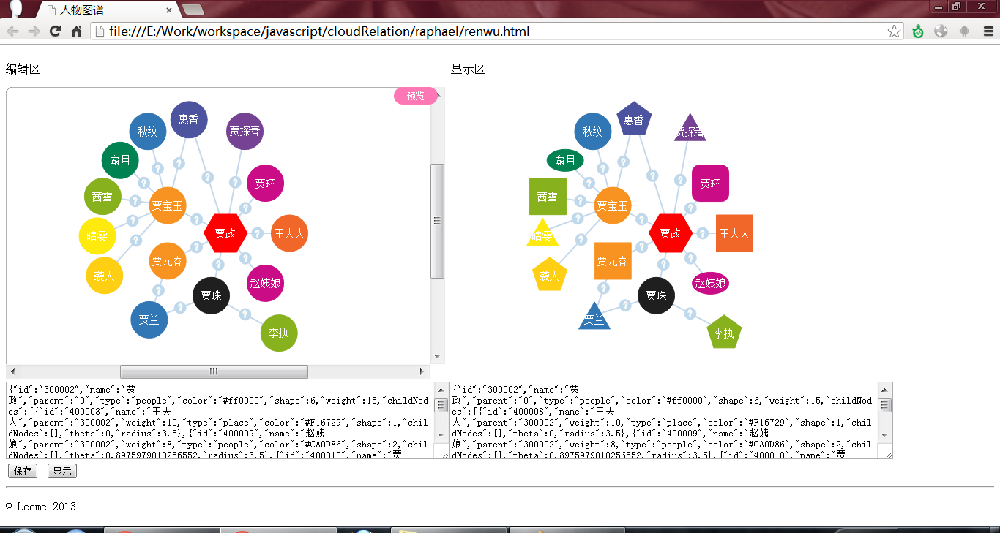

cloudRelation
=============

cloudRelation

使用方法：

var relation = new Relation({node: '#svg-container-view', width:600, height:400, mode: 'edit'}); relation.render(data); 

数据json格式：

{"id":"300002", //节点Id

"name":"贾政", //节点名称

"parent":"0", //父节点

"type":"people", //节点类型

"color":"#ff0000", //形状颜色

"shape":6, //形状类型

"weight":15, //权重

"childNodes":[{"id":"400008",
    
	"name":"王夫人",
    
	"parent":"300002",
    
	"weight":10,
    
	"type":"place",
    
	"color":"#F16729",
    
	"shape":1,
    
	"childNodes":[...]}
    
	]

}

node: Dom节点

mode：有两种模式，编辑模式和显示模式,编辑模式下形状可以拖动，显示模式下不可以

方法：

relation.preview(); //得到树形数据，包含形状形状的坐标

ralation.save(); //得到数据数组，平面数据

事件：

relation.on('nodeClick', function(e){}); //节点点击事件

ralation.on('relationClick', function(e){}); //两节点关系单击事件

e:{x: 967, y: 371, id: "500001", parentId: "400010"}

